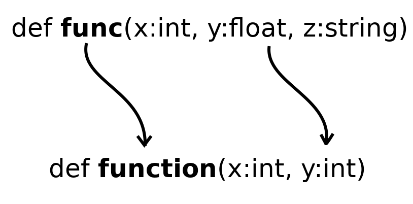

# Change function declaration
Consist in modifying the function signature, parameters and or function
name.



Shortly: duplicate, change, remove unused  
More shortly: let the IDE do it for you if it can

## How to - the best way
 * Example code
 ```python
    def func(x:int, y:float, z:string) -> int:
        s = int(y)
        for i in range(x):
            s += i
        return s     
        
    if __name__=='__main__':
        func(x=3, y=12.0, z='Hello')   
 ```

 * Refactor the function as much as possible 
 ```python
    def func(x:int, y:float, z:string) -> int:
        return sum(range(x)) + int(y)
        
    if __name__=='__main__':
        func(x=3, y=12.0, z='Hello')   
 ```
 
 * Use "Extract function" on the body to create a new wrapped function 
 ```python
    def function(x:int, y:int) -> int:
        return sum(range(x)) + int(y)
        
    def func(x:int, y:float, z:string) -> int:
        return function(x, y)
        
    if __name__=='__main__':
        func(x=3, y=12.0, z='Hello')   
 ```
 * Substitute old function calls
 ```python
    def function(x:int, y:float) -> int:
        return sum(range(x)) + int(y)
        
    def func(x:int, y:float, z:string) -> int:
        return function(x, y)
        
    if __name__=='__main__':
        function(x=3, y=12.0)   
 ```

 * Remove old function 
 ```python
    def function(x:int, y:float) -> int:
        return sum(range(x)) + int(y)
        
    if __name__=='__main__':
        function(x=3, y=12.0)    
 ```
