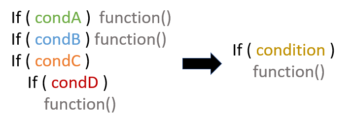

# Consolidate conditional expression 
Consist in changing a bunch of if conditions that call the same function or execute the same 
code with just one if condition.


 

## How to Consolidate conditional expression
Merge conditions with logic operators in couple until there's only one, than check if is 
[Extract function]("../Extract function/") is applicable.

 **Example**
 ```python
def calculate_amount(employee: Employee):
    if employee.seniority < 2: return 0
    if employee.months_unavailable > 12: return 0
    if employee.is_part_time:
        if employee.work_hours > 8:
            return 0

    return 10
 ```
 
 * Merge first 2 conditions with an "or" operator
 ```python    
def calculate_amount(employee: Employee):
    if employee.seniority < 2 \
            or employee.months_unavailable > 12: return 0
    if employee.is_part_time:
        if employee.work_hours > 8:
            return 0

    return 10
 ```

 * < Operation 2 >
 ```python    
 < Source code >
 ```
 
  * < Operation 3 >
 ```python    
 < Source code >
 ```