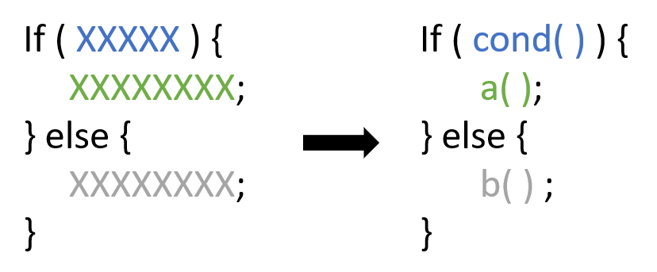

# Decompose conditional

Used to simplify an if statement.  
It consists in applying [Extract function]("../Extract function/") to the if condition and to both if branches.

<!--  -->

## How to Decompose conditional
 **Example**
 ```python
def function_to_refactor(selected_date: dt, plan: Plan, qty):
    result = 0

    if plan.summer_start_date < selected_date < plan.summer_end_date:
        result = qty * plan.summer_rate
    else:
        result = qty * plan.regular_rate

    return result
 ```
 
 * < Operation 1 >
 ```python    
 < Source code >
 ```

 * < Operation 2 >
 ```python    
 < Source code >
 ```
 
  * < Operation 3 >
 ```python    
 < Source code >
 ```