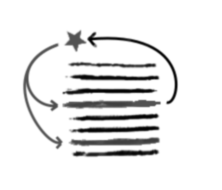

# Extract variable
Consiste in substitute an expression with a variable to make code clearer.  
This operation help understanding the code and debugging operation.

Inverse of [Inline Variable](../Inline%20variable)



Short version: assign expression to variable, replace expression with variable

## How to extract a function

**Example**
```python
def price(order: OrderClass): -> float
    # price = base_price - qty_discount + shipping
    return order.qty * order.item_price \ 
           - math.max(0, order.qty - 500) * order.item_price * 0.05 \
           + math.min(order.qty * order.item_price * 0.1, 100)
```

 * Ensure that the expression to refactor has no side effects
   ```python
   def price(order: OrderClass): -> float
       # order.qty * order.item_price has no side effects so can be refactored
       return order.qty * order.item_price \ 
              - math.max(0, order.qty - 500) * order.item_price * 0.05 \
              + math.min(order.qty * order.item_price * 0.1, 100)
   ```

 * Declare a variable and assign the expression to it
   ```python
   def price(order: OrderClass): -> float
       base_price = order.qty * order.item_price 
       # order.qty * order.item_price has no side effects so can be refactored
       return order.qty * order.item_price \ 
              - math.max(0, order.qty - 500) * order.item_price * 0.05 \
              + math.min(order.qty * order.item_price * 0.1, 100)
   ```
   
 * replace the expression, each time it is used with the variable testing each time 
   * substitution 1
     ```python
     def price(order: OrderClass): -> float
         base_price = order.qty * order.item_price        
         return base_price \ 
                - math.max(0, order.qty - 500) * order.item_price * 0.05 \
                + math.min(order.qty * order.item_price * 0.1, 100)
     ```
   * substitution 2
     ```python
     def price(order: OrderClass): -> float
         base_price = order.qty * order.item_price        
         return base_price \ 
                - math.max(0, order.qty - 500) * order.item_price * 0.05 \
                + math.min(base_price * 0.1, 100)
     ```
   
Is possible to refactor each expression to a variable.

 * Substitute qty discount expression
   ```python
   def price(order: OrderClass): -> float
      base_price = order.qty * order.item_price
      qty_discount = math.max(0, order.qty - 500) * order.item_price * 0.05        
      return base_price \ 
             - qty_discount \
             + math.min(base_price * 0.1, 100)
   ```
   
 * Substitute shipping price expression
   ```python
   def price(order: OrderClass): -> float
      base_price = order.qty * order.item_price
      qty_discount = math.max(0, order.qty - 500) * order.item_price * 0.05      
      shipping_price = math.min(base_price * 0.1, 100)  
      return base_price - qty_discount + shipping_price 
   ```
      