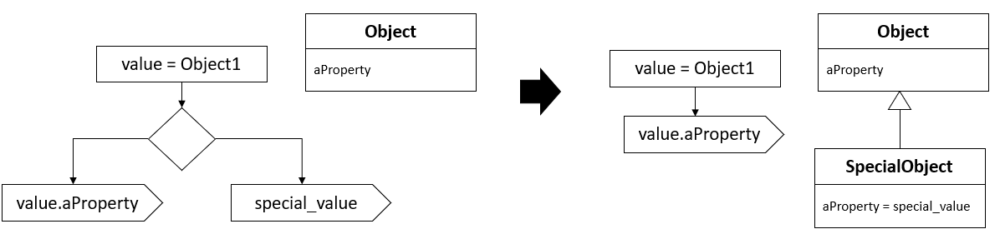

# Introduce special case
This widespread testing for a special case, plus a common response


 
Shortly: < Short version >

## How to < Name >
 **Example**
 ```python
 < Source code >   
 ```
 
 * < Operation 1 >
 ```python    
 < Source code >
 ```

 * < Operation 2 >
 ```python    
 < Source code >
 ```
 
  * < Operation 3 >
 ```python    
 < Source code >
 ```