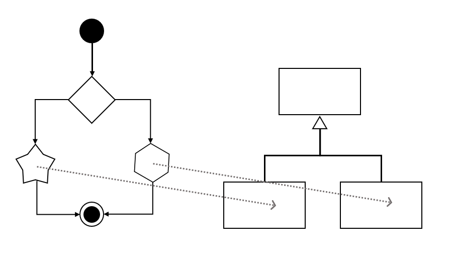

# Replace conditional with polimorphism
Sometimes is possible to replace an if condition or a switch using polimorfism and an OOP structure.
Each code block of the condition is demanded in an object that execute the logic and the main condition is substituted 
with a function call.



Shortly: duplicate condition function, create classes, use classes instead of switch/if 
 
## How to Replace conditional with polimorphism
Git history of main file with example
```bash
~$ git log --oneline
* ae0044e Added image
* 1f5e702 Overloaded method plumage in subclasses
* 6faead1 Used factory method
* 24f1d81 Created BirdData class
* 12faf01 Created empty subclasses
* 2bcbd97 Edit function to return object method result
* 4469ae2 Edit main to print plumage from class
* 70f0bde Added function inside class
* 3595ff0 Main created
* aab7973 First commit of section
```

 * Create 1 class for each condition and a superclass
 * Duplicate the function to refactor in the superclass 
 * Override the function in each subclass returning a value 
 * Add a factory method in the superclass to instantiate correct classes depending on condition
 * Modify outside class function to return a method value of created instance by factory method 
   * Use [Inline function](../Inline%20function) if possible   
 * Modify the function in the superclass to return a default value  
