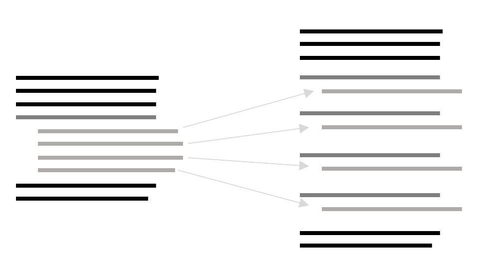

# Split loop
Split loop is used to separate 2 or more different code part executed in the same loop in many loops.
Split loop it's very useful before function extract.


 
Shortly: duplicate n times, edit each duplication 

## How to split loop

**example**
```python
average_age = 0
total_salary = 0

for p in people:
    average_age += p.age
    total_salary += p.salary

average_age = average_age / len(people)
```
 * Copy the loop
   ```python
   average_age = 0
   total_salary = 0

   for p in people:
       average_age += p.age
       total_salary += p.salary
       
   for p in people:
       average_age += p.age
       total_salary += p.salary
    
   average_age = average_age / len(people)
   ```

 * Identify duplicated side effects
   ```python
   average_age = 0
   total_salary = 0

   for p in people:
       average_age += p.age  # This one
       total_salary += p.salary  # And this one
       
   for p in people:
       average_age += p.age  # This one
       total_salary += p.salary  # And this one
    
   average_age = average_age / len(people)
   ```

 * Remove duplicated side effects so that each loop contain only 1 behavior
   ```python
   average_age = 0
   total_salary = 0
   
   for p in people:
       total_salary += p.salary
   
   for p in people:
       average_age += p.age
    
   average_age = average_age / len(people)
   ```
